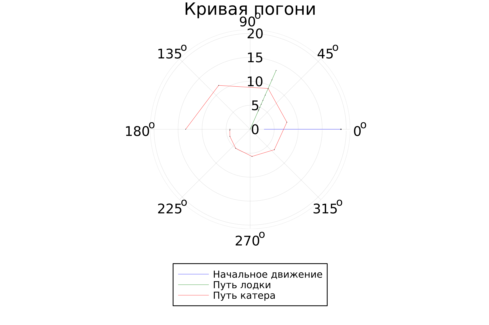

---
## Front matter
title: "Лабораторная работа № 2"
subtitle: "Задача о погоне"
author: "Брезгулевский Иван Алексеевич"

## Generic otions
lang: ru-RU
toc-title: "Содержание"

## Bibliography
bibliography: bib/cite.bib
csl: pandoc/csl/gost-r-7-0-5-2008-numeric.csl

## Pdf output format
toc: true # Table of contents
toc-depth: 2
lof: true # List of figures
lot: false
fontsize: 12pt
linestretch: 1.5
papersize: a4
documentclass: scrreprt
## I18n polyglossia
polyglossia-lang:
  name: russian
  options:
	- spelling=modern
	- babelshorthands=true
polyglossia-otherlangs:
  name: english
## I18n babel
babel-lang: russian
babel-otherlangs: english
## Fonts
mainfont: PT Serif
romanfont: PT Serif
sansfont: PT Sans
monofont: PT Mono
mainfontoptions: Ligatures=TeX
romanfontoptions: Ligatures=TeX
sansfontoptions: Ligatures=TeX,Scale=MatchLowercase
monofontoptions: Scale=MatchLowercase,Scale=0.9
## Biblatex
biblatex: true
biblio-style: "gost-numeric"
biblatexoptions:
  - parentracker=true
  - backend=biber
  - hyperref=auto
  - language=auto
  - autolang=other*
  - citestyle=gost-numeric
## Pandoc-crossref LaTeX customization
figureTitle: "Рис."
tableTitle: "Таблица"
listingTitle: "Листинг"
lofTitle: "Список иллюстраций"
lotTitle: "Список таблиц"
lolTitle: "Листинги"
## Misc options
indent: true
header-includes:
  - \usepackage{indentfirst}
  - \usepackage{float} # keep figures where there are in the text
  - \floatplacement{figure}{H} # keep figures where there are in the text
---

# Цель работы

Цель работы - решение задачи о погоне.

# Задание

- запишем уравнение, описывающее движение катера, с начальными условиями для двух случаев
- Построим траекторию движения катера и лодки для двух случаев
- Найдем точку пересечения траектории катера и лодки 

# введение

- Тангенциальная скорость [1] - составляющая вектора скорости, перпендикулярная линии, соединяющей источник и наблюдателя. Измеряется собственному движению - угловому перемещению источника.
- Радиальная скорость [2] — проекция скорости точки на прямую, соединяющую её с выбранным началом координат.
- Полярная система координат [3] — двумерная система координат, в которой каждая точка на плоскости определяется двумя числами — полярным углом и полярным радиусом.

# Выполнение лабораторной работы
1.
Принимаем за $t_0=0, X_0=0$ - место нахождения лодки браконьеров в момент, когда их обнаруживают катера береговой охраны. После введем полярные координаты.
Время, за которое они пройдут это расстояние, вычисляется как $\frac{x}{υ}$ или $\frac{x+k}{υ}$ (для второго случая $\frac{x-k}{υ}$). Так как время одно и то же, то эти величины одинаковы.
Тогда неизвестное расстояние можно найти из следующего уравнения: $\frac{x}{υ} = \frac{x+k}{υ}$ - в первом случае, $\frac{x}{υ} = \frac{x-k}{υ}$ во втором случае.
2.
Отсюда мы найдем два значения $x_1$ и $x_2$, задачу будем решать для двух случаев :

$x_1=\frac{k}{n+1}$ ,при $\theta=0$
$x_2=\frac{k}{n-1}$ ,при $\theta=-\pi$

3.
Найдем тангенциальную скорость[1] для нашей задачи $υ_t=r\frac{d\theta}{dt}$.
Вектора образуют прямоугольный треугольник, откуда по теореме Пифагора[2] можно найти тангенциальную скорость $υ_t= \sqrt{n^2 υ_r^2-v^2}$. Поскольку, радиальная скорость[3] равна $υ$, то тангенциальную скорость находим из уравнения $υ_t= \sqrt{n^2 υ^2-υ^2 }$. Следовательно, $υ_τ=υ\sqrt{n^2-1}$.

4.
Тогда получаем $r\frac{d\theta}{dt}=υ\sqrt{n^2-1}$

5. Построим траектории движения катера береговой охраны и лодки с помощью Julia  (@fig:005 - @fig:007).

код: using plots 
using DifferentialEquations

const a = 18.9
const n = 5.5

const r0 = a/(n + 1)
const r0_2 = a/(n - 1)

const T = (0, 2*pi)
const T_2 + (-pi, pi)

function F(u, p, t)
    return u / sqrt(n*n - 1)
end

problem = ODEProblem(F, r0, T)

result = solve(problem, abstol=1e-8, reltol=1e-8)
@show result.u
@show result.t 

dxR =rand(1:size(result.t)[1])
rAngles = [result.t[dxR] for i in 1:size(result.t)[1]]

plt = plot(proj=:polar, aspect_ratio=:equal, dpi = 1200, legend=true, bg=:white)
plot!(plt, xlabel+"theta", ylabel="r(t", title="кривая погони", legend=:outerbottom)
plot!(plt, [0.0,0.0], [a, r0], label = "начальное движение", color=:green, lw=0.2)
scatter!(plt, [0.0], [a], label="", mc="green, ms=0.2")

plot!(Iplt, [rAngles[1], rAngles[2]], [0.0, result.u[size(result.u)[1]]], label="Путь лодки", color=:blue, lw=0.2)
scatter!(plt, rAngles, result.u, label="", mc=:blue, ms=0.005)

plot!(plt, result.t, result.u, xlabel="theta", ylabel="r(t)", label="Путь катера", color=:red, lw=0.2)
scatter!(plt, result.t, result.u, label="", mc=:red, ms=0.005)

savefig(plt, "lab02-01.png")

problem = ODEProblem(F, r0_2, T_2)
result = solve(problem, abstol=1e-8, reltol=1e-8)
dxR = rand(1:size(result.t)[1])
rAngles = [result.t[dxR] for i in 1:size(result.t)[1]]

plt1 = plot(proj=:polar, aspect_ratio=:equal, dpi = 1200, legend=true, bg=:white)

plot!(plt1, xlabel="theta", ylabel="r(t)", title="Кривая погони", legend=:outerbottom)

plot!(plt1, [0.0,0.0], [a, r0], label = "начальное движение", color=:green, lw=0.2)
scatter!(plt1, [0.0], [a], label="", mc=:green, ms=0.2)

plot!(plt1, [rAngles[1], rAngles[2]], [0.0, result.u[size(result.u)[1]]], label="Путь лодки", color=:blue, lw=0.2)
scatter!(plt1, rAngles, result.u, label="", mc="blue", ms=0.005)

plot!(plt1, result.t, result.u, xlabel="theta", ylabel="r(t", label=" путь катера", color=:red, lw=0.2)
scatter!(plt1, result.t, result.u, label="", mc=:red, ms=0.005)

savefig(plt1, "lab02-02.png")

{#fig:006 width=90%}

{#fig:007 width=90%}

6. Построение траекторий с помощью языка OpenModelica не имеет смысла, так как это невозможно сделать, используя базовые средства.

# Выводы

мы решили задачу о погоне и построили траектории движения лодки и катера. Также мы выяснили, что построение траекторий движения для данного
случая не является подходящей задачей для языка OpenModelica.

# Список литературы{.unnumbered}

[1] http://www.astronet.ru/db/msg/1178122

[2] https://ru.wikipedia.org/wiki/%D0%A0%D0%B0%D0%B4%D0%B8%D0%B0%D0%BB%D1%8C%D0%BD%D0%B0%D1%8F_%D1%81%D0%BA%D0%BE%D1%80%D0%BE%D1%81%D1%82%D1%8C

[3] https://ru.wikipedia.org/wiki/%D0%9F%D0%BE%D0%BB%D1%8F%D1%80%D0%BD%D0%B0%D1%8F_%D1%81%D0%B8%D1%81%D1%82%D0%B5%D0%BC%D0%B0_%D0%BA%D0%BE%D0%BE%D1%80%D0%B4%D0%B8%D0%BD%D0%B0%D1%82
